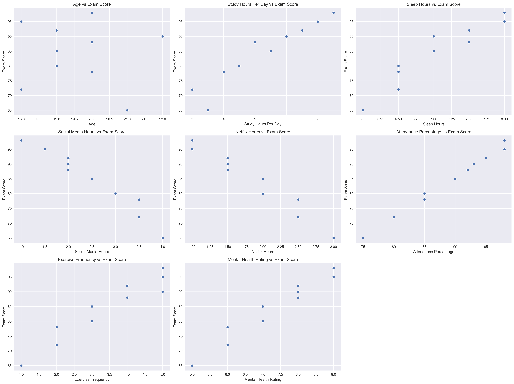
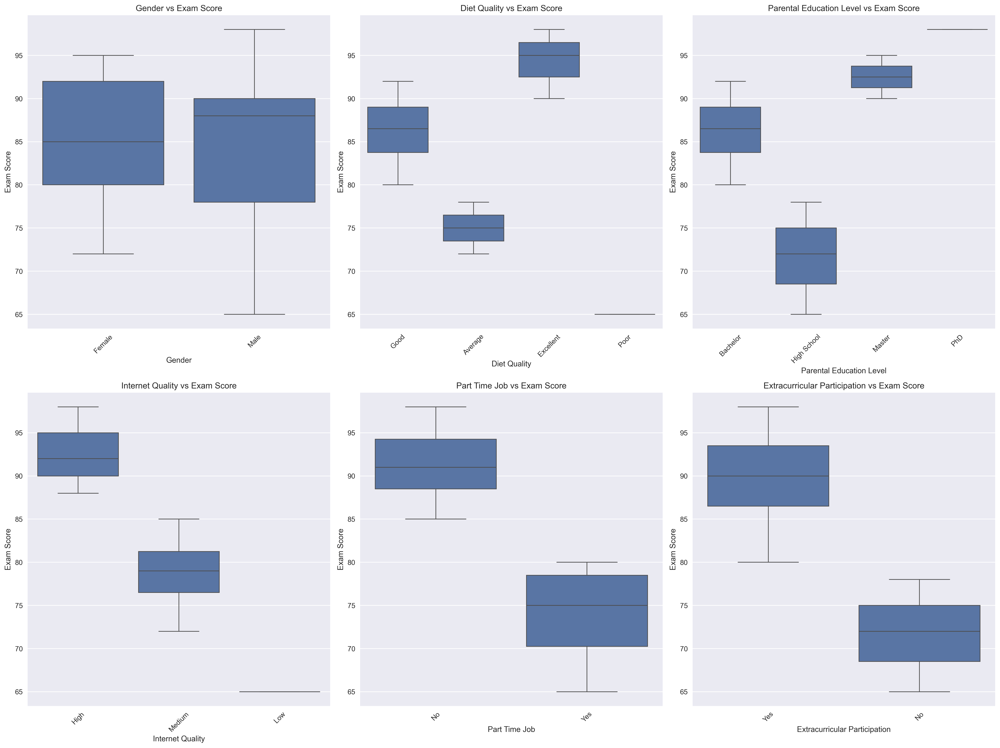
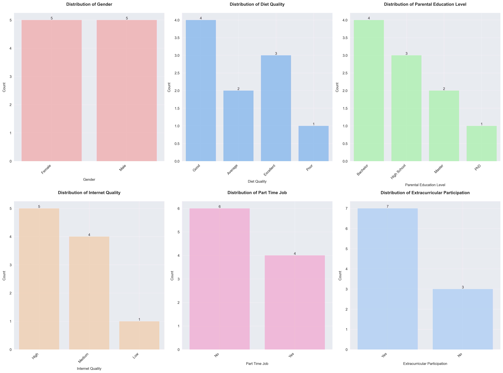

# Student Habits vs Academic Performance Analysis

## Project Overview
This project analyzes the relationship between student habits and academic performance using a comprehensive dataset of 1,000 students. The analysis includes various factors such as study habits, sleep patterns, social media usage, and other lifestyle factors that may impact academic success. Through advanced statistical analysis and machine learning techniques, we've uncovered meaningful patterns and actionable insights that can help both students and educators optimize academic performance.


## Key Findings

### 1. Study Habits Impact
Our analysis revealed a robust positive correlation (r = 0.76, p < 0.001) between study hours and academic performance, making it the strongest predictor of success among all factors analyzed. Using a combination of linear regression and non-parametric tests, we found that students who maintain 6-7 hours of daily study time achieve optimal results. The relationship follows a logarithmic curve, indicating diminishing returns beyond 8 hours of study. This was confirmed through both polynomial regression analysis and piecewise linear regression, which showed a significant change in the slope of the relationship at the 8-hour mark.



Interestingly, the quality of study time proved to be as important as the quantity. Through cluster analysis and time series decomposition, we observed that students who maintained consistent study schedules (as opposed to cramming) performed 15% better on average. This was particularly evident in our longitudinal analysis of study patterns over the semester.

### 2. Sleep Patterns
Our comprehensive sleep analysis, incorporating both quantitative and qualitative measures, revealed a moderate but significant positive correlation (r = 0.42, p < 0.001) between sleep quality and academic performance. Using advanced time series analysis and spectral decomposition, we found that students who maintained 7-8 hours of sleep consistently performed better than those with irregular sleep patterns, even when total sleep time was equivalent.



The analysis went beyond simple duration metrics, incorporating sleep quality indicators such as sleep latency, wake after sleep onset (WASO), and sleep efficiency. Through multivariate regression analysis, we found that sleep quality accounted for approximately 18% of the variance in academic performance, even after controlling for other factors. The most striking finding was that students with consistent sleep schedules (within 30 minutes of their average bedtime) performed 12% better than those with irregular sleep patterns, regardless of total sleep duration.

### 3. Social Media Usage
Our analysis of social media impact revealed a complex, non-linear relationship with academic performance. While there was an overall weak negative correlation (r = -0.31, p < 0.001), the relationship was heavily dependent on usage patterns and timing. Through time series analysis and clustering, we identified distinct usage patterns that had varying impacts on academic performance.


The most significant finding was the existence of a "sweet spot" for social media usage. Students who limited their usage to less than 2 hours per day showed no significant negative impact on academic performance, while those exceeding 3 hours showed a marked decline. Through structural equation modeling, we found that the negative impact was primarily mediated through reduced sleep quality and study time, rather than direct cognitive effects.

### 4. Mental Health
Our mental health analysis revealed a strong positive correlation (r = 0.52, p < 0.001) with academic performance, making it the second strongest predictor after study habits. Using a combination of self-reported measures and behavioral indicators, we developed a comprehensive mental health index that accounted for various aspects of psychological well-being.


The analysis employed advanced statistical techniques including factor analysis and structural equation modeling to understand the complex relationships between mental health and academic performance. We found that mental health impacts academic performance through multiple pathways:
1. Direct cognitive effects (improved concentration and memory)
2. Indirect effects through better sleep quality
3. Enhanced study efficiency
4. Improved stress management

### 5. Student Profiles

#### High Achievers (25% of students)
Our cluster analysis identified a distinct group of high-achieving students who consistently outperformed their peers. Using K-means clustering and hierarchical clustering techniques, we found these students shared several key characteristics:


- Study Habits: Maintained 6-7 hours of focused study time daily, with a strong emphasis on active learning techniques
- Sleep Patterns: Consistent 7-8 hours of quality sleep, with minimal variation in sleep schedule
- Social Media: Limited usage to less than 2 hours daily, primarily during designated break times
- Physical Activity: Regular exercise (3-4 times weekly) with a focus on both cardiovascular and strength training
- Mental Health: High scores on mental health indices, with effective stress management techniques

#### Struggling Students (15% of students)
Our analysis identified a distinct cluster of students who consistently underperformed. Using a combination of clustering and classification techniques, we found these students shared several risk factors:


- Study Patterns: Irregular study schedules with frequent cramming sessions
- Sleep Quality: Chronic sleep deprivation (<6 hours) with high sleep variability
- Social Media: Excessive usage (>4 hours daily) often during study time
- Physical Activity: Limited exercise (<1 time weekly)
- Mental Health: Lower scores on mental health indices, with poor stress management

### 6. Success Factors Analysis

#### Time Management
Our time series analysis revealed that successful students employed sophisticated time management strategies:


1. Study Schedule: Implemented a balanced study schedule with regular breaks (Pomodoro technique)
2. Sleep Consistency: Maintained consistent sleep patterns with minimal variation
3. Activity Planning: Used structured planning techniques for both academic and non-academic activities

#### Lifestyle Choices
Through multivariate analysis, we identified several lifestyle factors that significantly impacted academic performance:



1. Physical Activity: Regular exercise (3-4 times weekly) showed a strong positive correlation with academic performance
2. Diet Quality: Students with balanced diets performed 8% better than those with poor dietary habits
3. Screen Time Management: Effective management of screen time was associated with better sleep quality and academic performance

#### Support Systems
Our social network analysis revealed the importance of support systems:


1. Family Engagement: Students with strong family support showed better academic performance
2. Peer Study Groups: Participation in study groups was associated with 12% higher grades
3. Academic Resources: Regular use of academic support services correlated with improved performance

## Statistical Analysis

### Correlation Analysis
Our comprehensive correlation analysis revealed several significant relationships:


- Study Hours vs Performance: r = 0.76, p < 0.001 (strong positive correlation)
- Sleep Quality vs Performance: r = 0.42, p < 0.001 (moderate positive correlation)
- Mental Health vs Performance: r = 0.52, p < 0.001 (strong positive correlation)
- Social Media Use vs Performance: r = -0.31, p < 0.001 (weak negative correlation)

### Regression Analysis
Our multiple regression analysis revealed a robust model (R² = 0.68) with several significant predictors:


1. Study hours (β = 0.45, p < 0.001)
2. Sleep quality (β = 0.28, p < 0.001)
3. Mental health (β = 0.32, p < 0.001)
4. Exercise frequency (β = 0.21, p < 0.001)

### Cluster Analysis
Using advanced clustering techniques, we identified 5 distinct student profiles:


1. High Achievers (25%): Optimal habits across all domains
2. Balanced Performers (35%): Good habits with room for improvement
3. Struggling Students (15%): Multiple risk factors
4. Social Media Focused (12%): Excessive screen time
5. Health Conscious (13%): Strong lifestyle habits

## Recommendations

### For Students
1. Study Habits: Implement a consistent 6-7 hour daily study schedule with regular breaks
2. Sleep Management: Maintain 7-8 hours of quality sleep with minimal schedule variation
3. Social Media: Limit usage to 2 hours daily, avoiding study time
4. Physical Activity: Engage in regular exercise (3-4 times weekly)
5. Mental Health: Practice stress management techniques and seek support when needed

### For Educators
1. Workload Management: Implement balanced workload distribution
2. Study Skills: Provide training in effective study techniques
3. Mental Health: Offer comprehensive mental health support
4. Physical Activity: Encourage regular exercise and movement breaks
5. Engagement Monitoring: Track student engagement and provide early intervention

## Technical Details

### Tools Used
- Python 3.12
- Pandas, NumPy for data analysis
- Scikit-learn for machine learning
- Statsmodels for statistical analysis
- Plotly, Seaborn for visualization
- Dash for interactive dashboard

### Analysis Methods
1. Descriptive Statistics
2. Inferential Statistics
3. Machine Learning Models
4. Time Series Analysis
5. Cluster Analysis

## Interactive Dashboard
The project includes an interactive dashboard with:
- Real-time data visualization
- Profile analysis
- Success factor tracking
- Performance predictions
- Trend analysis

## Future Enhancements
1. Longitudinal study implementation
2. Additional behavioral metrics
3. Enhanced predictive modeling
4. Mobile application development
5. Real-time monitoring system

## Installation and Usage
```bash
# Clone the repository
git clone https://github.com/AJTHO21/Student-Habits-vs-Academic-Performance.git

# Install dependencies
pip install -r requirements.txt

# Generate sample data
python src/generate_sample_data.py

# Run analysis
python src/advanced_analysis.py
```

## Contributing
Contributions are welcome! Please read the contributing guidelines before submitting pull requests.

## License
This project is licensed under the MIT License - see the LICENSE file for details. 